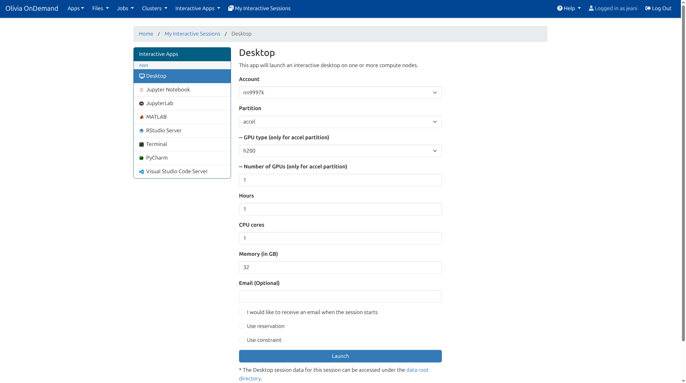
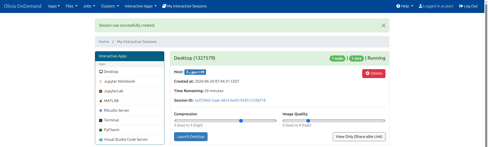
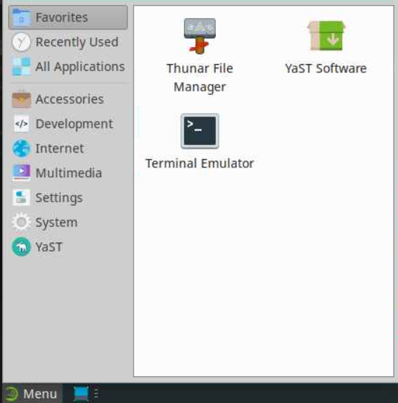
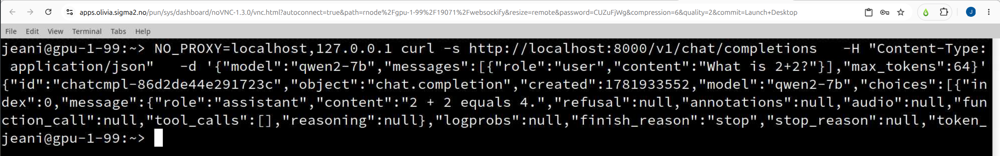
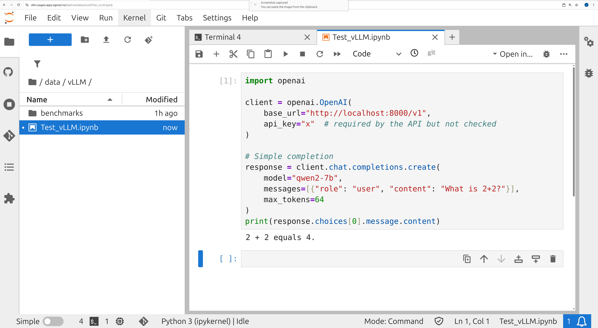
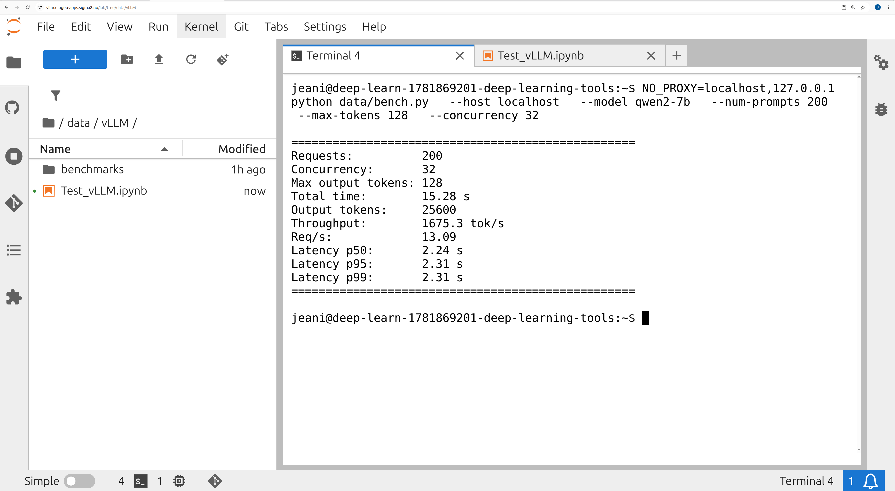

# vLLM Inference — Olivia, NREC, and NIRD

[](https://doi.org/10.5281/zenodo.20792609)
[](https://github.com/users/j34ni/packages/container/package/vllm-on-olivia)

This document covers running [vLLM](https://github.com/vllm-project/vllm) on three Norwegian research computing platforms: the [Olivia HPC cluster](https://documentation.sigma2.no/hpc_machines/olivia) (Sigma2), an [NREC](https://www.nrec.no/) OpenStack VM, and the [NIRD](https://www.sigma2.no/nird) Kubernetes cluster (Sigma2).

The approach uses self-contained Apptainer or Docker containers — the same model and configuration can run on any of the three platforms, making it straightforward to develop on one and run production workloads on another, or to switch platforms when needed. The benchmarks below use `Qwen2-7B-Instruct` as a representative 7B instruction-tuned model, but the setup works for any model supported by vLLM.

---

## Hardware

| | Olivia | NREC VM | NIRD |
|---|---|---|---|
| GPU | 1× GH200 120GB (HBM3) | 1× L40S-24Q (vGPU, 24 GiB GDDR6) | 2× V100-16GB (GDDR6) |
| Memory bandwidth | ~3.35 TB/s | ~960 GB/s | 2× ~900 GB/s |
| Architecture | aarch64 (ARM64) | x86_64 | x86_64 |
| CUDA driver | 13.0 | 12.2 (vGPU, managed by NREC) | 12.8 |
| Scheduler | SLURM | direct (no scheduler) | Kubernetes (NIRD toolkit) |
| Access | Sigma2 allocation | NREC project | Sigma2 allocation |

---

## Benchmark results — Qwen2-7B-Instruct

Generic benchmark: fixed input prompt (~300 tokens), concurrency=32, 200 requests, `--max-model-len 8192`.

| Platform | dtype | max-tokens | Throughput (tok/s) | p50 (s) | p95 (s) |
|---|---|---|---|---|---|
| Olivia, 1× GH200 | bfloat16 | 512 | 4855 | 2.96 | 3.44 |
| Olivia, 1× GH200 | bfloat16 | 128 | 4833 | 0.76 | 0.78 |
| Olivia, 1× GH200 | bfloat16 | 512 (concurrency=1) | 187 | 2.74 | 2.74 |
| NIRD, 2× V100 (TP=2) | float16 | 512 | 1430 | 9.34 | 17.72 |
| NIRD, 2× V100 (TP=2) | float16 | 128 | 1678 | 2.24 | 2.30 |
| NREC, 1× L40S-24Q | bfloat16 | 512 | 1111 | 12.50 | 18.75 |
| NREC, 1× L40S-24Q | bfloat16 | 128 | 1188 | 3.14 | 3.21 |
| NREC, 1× L40S-24Q | bfloat16 | 512 (concurrency=1) | 49 | 10.47 | 10.49 |

---

## Paraphrase benchmark — NLP research use case

Each request asks the model to rewrite an academic text in different words while preserving its meaning. This is a common operation in NLP research pipelines, whether for data augmentation, style transfer, or robustness evaluation. Concurrency=32, 100–200 requests per run.

The prompt used:

```
Paraphrase the following academic text while preserving its meaning:

We investigate the impacts of NLP research published in top-tier conferences (ACL, EMNLP, and NAACL)
from 1979 to 2024. By analyzing citations from research articles and external sources such as patents,
media, and policy documents, we examine how different NLP topics are consumed both within the academic
community and by the broader public. Our findings reveal that language modeling has the widest internal
and external influence, while linguistic foundations have lower impacts. We also observe that internal
and external impacts generally align, but topics like ethics, bias, and fairness show significant
attention in policy documents with much fewer academic citations. Language models have transformed the
way researchers approach text understanding and generation tasks. The rapid development of
transformer-based architectures has enabled significant progress across a wide range of NLP benchmarks,
from question answering and summarization to machine translation and dialogue systems. These advances
have been accompanied by an increasing focus on the societal implications of NLP technologies,
including issues of bias, fairness, and interpretability.
```

(repeated N× to reach the target input length)

### Throughput at ~644 tokens input, max-tokens=512

| Platform | Throughput (tok/s) | p50 (s) | p95 (s) |
|---|---|---|---|
| Olivia, 1× GH200 | 4266 | 1.42 | 2.75 |
| NIRD, 2× V100 (TP=2) | 1384 | 4.88 | 9.40 |
| NREC, 1× L40S-24Q | 1154 | 5.70 | 10.76 |

### Throughput across input lengths (Olivia vs NREC)

| Input tokens | Max output tokens | Olivia GH200 (tok/s) | NREC L40S-24Q (tok/s) | Ratio |
|---|---|---|---|---|
| ~644 | 512 | 4266 | 1154 | 3.7× |
| ~1052 | 1024 | 3226 | 928 | 3.5× |
| ~2072 | 2048 | 3651 | 970 | 3.8× |

Throughput decreases slightly with longer inputs due to the higher prefill cost, but remains stable between 1000 and 2000 tokens — chunked prefill allows vLLM to batch decode steps across requests, partially compensating for the longer prefill at high concurrency. The GH200/L40S ratio stays consistently at ~3.5–3.8× regardless of input length.

### Estimated processing time for 50,000 documents (~512 output tokens each)

| Config | Estimated time |
|---|---|
| NREC, 1× L40S-24Q | ~6.2 hours |
| NIRD, 2× V100 (TP=2) | ~5.0 hours |
| Olivia, 1× GH200 | ~1.7 hours |

---

## Choosing a platform

| | Olivia | NREC | NIRD |
|---|---|---|---|
| Throughput | ✅ Highest (~4× others) | 🟡 Medium | 🟡 Medium |
| Latency | ✅ Best | 🟡 Medium | 🟡 Medium |
| Persistence | ❌ SLURM job | ✅ VM always on | ✅ Toolkit session |
| Queue wait | ❌ Yes | ✅ No | ✅ No |
| External API access | ✅ Via SSH tunnel | ✅ Direct | ❌ Internal only |
| Data sovereignty | ✅ Norwegian | ✅ Norwegian | ✅ Norwegian |

**Use Olivia when:**
- You need maximum throughput — ~4× faster than NREC or NIRD
- You are running larger models (>24 GiB) that require more VRAM
- Batch processing of large datasets where total compute time matters

**Use NREC when:**
- You need a persistent public endpoint without SLURM job time limits
- You are prototyping and need fast iteration without queue waits
- The model fits in 24 GiB

**Use NIRD when:**
- You already have a NIRD allocation and a JupyterLab workflow
- You need a persistent session that survives disconnections
- You want API access integrated with notebook-based research

---

## Setup

### Olivia

The scripts below use a `$PROJECT` variable. Define it in your `.bashrc`:

```bash
export PROJECT=/cluster/projects/<project_id>/<username>
```

#### Container recipe (`containers/vllm-aarch64.def`)

```
Bootstrap: docker
From: nvcr.io/nvidia/cuda:13.0.3-cudnn-devel-ubuntu24.04
%post
    apt-get update && apt-get install -y wget && rm -rf /var/lib/apt/lists/*
    wget -q https://github.com/conda-forge/miniforge/releases/latest/download/Miniforge3-Linux-aarch64.sh -O /tmp/miniforge.sh
    bash /tmp/miniforge.sh -b -p /opt/conda
    rm /tmp/miniforge.sh
    /opt/conda/bin/conda install -y -c conda-forge \
        ninja \
        "python=3.12.13"
    /opt/conda/bin/pip install "vllm==0.23.0" \
        --extra-index-url https://download.pytorch.org/whl/cu130
    /opt/conda/bin/pip install \
        "fastapi==0.136.0" \
        "prometheus-fastapi-instrumentator==8.0.0"
    ln -sf /usr/local/cuda/bin/nvcc /opt/conda/bin/nvcc
    ln -sf /usr/local/cuda/targets/sbsa-linux/include/fatbinary_section.h \
           /usr/include/fatbinary_section.h
    /opt/conda/bin/conda clean -afy
%environment
    export PATH=/usr/local/cuda/nvvm/bin:/usr/local/cuda/bin:/opt/conda/bin:$PATH
    export LD_LIBRARY_PATH=/usr/local/cuda/lib64:/usr/local/cuda/lib:/opt/conda/lib:$LD_LIBRARY_PATH
    export CUDA_HOME=/usr/local/cuda
%labels
    Architecture  aarch64 / NVIDIA Grace Hopper (GH200)
    CUDA          cuda-13.0.3-cudnn-devel-ubuntu24.04
    Framework     vllm-0.23.0 / torch-2.11.x+cu130 / fastapi-0.136.0
```

#### Building the container

Build by submitting a SLURM job (there are no aarch64 login nodes on Olivia):

```bash
apptainer build --force \
    $PROJECT/vllm-on-olivia/containers/vllm-aarch64.sif \
    containers/vllm-aarch64.def
```

#### Downloading model weights

```bash
apptainer exec \
    --bind $PROJECT:$PROJECT \
    $PROJECT/vllm-on-olivia/containers/vllm-aarch64.sif \
    bash -c "pip install -q huggingface_hub && \
        hf download Qwen/Qwen2-7B-Instruct \
            --local-dir $PROJECT/models/Qwen2-7B-Instruct"
```

#### Option A — SLURM batch job (`slurm/qwen2-7b-instruct-vllm.sh`)

Submit a batch job when you need vLLM to run unattended for an extended period:

```bash
#!/bin/bash
#SBATCH --account=<account>
#SBATCH --job-name=qwen2-7b-1gpu
#SBATCH --partition=accel
#SBATCH --nodes=1
#SBATCH --ntasks-per-node=1
#SBATCH --gpus-per-node=1
#SBATCH --mem-per-gpu=96G
#SBATCH --time=24:00:00

SIF=$PROJECT/vllm-on-olivia/containers/vllm-aarch64.sif
MODEL=$PROJECT/models/Qwen2-7B-Instruct
CACHE=$PROJECT/vllm-on-olivia/cache

export APPTAINER_TMPDIR=${CACHE}/apptainer/tmp
export APPTAINER_CACHEDIR=${CACHE}/apptainer/cache
mkdir -p ${APPTAINER_TMPDIR} ${APPTAINER_CACHEDIR}

export no_proxy=localhost,127.0.0.1

apptainer exec --nv \
    --env XDG_CACHE_HOME=${CACHE} \
    --env TORCHINDUCTOR_CACHE_DIR=${CACHE}/torchinductor \
    --env VLLM_MEMORY_PROFILER_ESTIMATE_CUDAGRAPHS=1 \
    --env no_proxy=localhost,127.0.0.1 \
    --env NCCL_NET=Socket \
    --env NCCL_IB_DISABLE=1 \
    --bind $PROJECT:$PROJECT \
    ${SIF} \
    python -m vllm.entrypoints.openai.api_server \
        --model ${MODEL} \
        --served-model-name qwen2-7b \
        --host 0.0.0.0 \
        --port 8000 \
        --tensor-parallel-size 1 \
        --dtype bfloat16 \
        --max-model-len 8192 \
        --gpu-memory-utilization 0.87
```

`NCCL_NET=Socket` is required for single-node jobs.

`vllm serve` (the CLI entrypoint) fails with local paths in vLLM 0.23.0 due to a HuggingFace repo ID validation bug. Use `python -m vllm.entrypoints.openai.api_server` instead.

#### Option B — Interactive session via Open OnDemand

Open OnDemand (OOD) lets you launch an interactive terminal on a compute node directly from your browser — useful for shorter runs, testing, or when you want to monitor the server in real time.

The steps below assume the `.sif` and model weights are already in place (see above). The expected layout under `$PROJECT/vllm-on-olivia/` is:

```
containers/
  vllm-aarch64.sif
models/
  Qwen2-7B-Instruct/
slurm/
  start-vllm-olivia.sh
cache/
logs/
```

**1. Launch a Terminal session**

1. Go to [apps.olivia.sigma2.no](https://apps.olivia.sigma2.no)
2. Launch the **Terminal** app from Interactive Apps
3. Select your account, request **1 GPU**, and launch

> 

4. Wait for the status to switch to `Running`, then open the terminal

> 

5. In the menu (bottom left) select **Terminal Emulator**

> 

> **Copy-paste in Chrome**: if `Ctrl+V` does not work, click the padlock/info icon to the left of the `apps.olivia.sigma2.no` URL and allow **clipboard** access for this site.

**2. The startup script**

The `start-vllm-olivia.sh` script lives in the repo under `slurm/`:

```bash
#!/bin/bash
MODEL=$PROJECT/models/Qwen2-7B-Instruct
LOGDIR=$PROJECT/vllm-on-olivia/logs

mkdir -p "$LOGDIR"

if [ ! -d "$MODEL" ]; then
    echo "Model not found at $MODEL, aborting"
    exit 1
fi

python -m vllm.entrypoints.openai.api_server \
    --model "$MODEL" \
    --served-model-name qwen2-7b \
    --host 0.0.0.0 \
    --port 8000 \
    --tensor-parallel-size 1 \
    --dtype bfloat16 \
    --max-model-len 8192 \
    --gpu-memory-utilization 0.87
```

```bash
chmod +x $PROJECT/vllm-on-olivia/slurm/start-vllm-olivia.sh
```

The vLLM command runs in the foreground here — `tmux` (next step) provides the persistence. An `apptainer exec` whose internal process is backgrounded exits as soon as Apptainer returns control, regardless of `nohup`.

**3. Launch vLLM inside tmux**

```bash
tmux new-session -d -s vllm "apptainer exec --nv \
    --env XDG_CACHE_HOME=$PROJECT/vllm-on-olivia/cache \
    --env TORCHINDUCTOR_CACHE_DIR=$PROJECT/vllm-on-olivia/cache/torchinductor \
    --env VLLM_MEMORY_PROFILER_ESTIMATE_CUDAGRAPHS=1 \
    --env no_proxy=localhost,127.0.0.1 \
    --env NCCL_NET=Socket \
    --env NCCL_IB_DISABLE=1 \
    --bind $PROJECT:$PROJECT \
    $PROJECT/vllm-on-olivia/containers/vllm-aarch64.sif \
    bash $PROJECT/vllm-on-olivia/slurm/start-vllm-olivia.sh"
```

Follow the logs:

```bash
tmux attach -t vllm
```

`Ctrl+B` then `D` to detach without killing the session. The server is ready once you see:

```
INFO:     Application startup complete.
```

**4. Test from the same node**

```bash
NO_PROXY=localhost,127.0.0.1 curl -s http://localhost:8000/v1/chat/completions \
  -H "Content-Type: application/json" \
  -d '{"model":"qwen2-7b","messages":[{"role":"user","content":"What is 2+2?"}],"max_tokens":64}'
```

> 

`NO_PROXY` is required because compute nodes route traffic through a proxy that intercepts connections to `localhost`.

**5. Accessing from a local machine**

`localhost:8000` is only reachable from the compute node itself. To access it from outside the cluster, open an SSH tunnel from your local machine.

Find the node name first:

```bash
squeue -u $USER
```

Note the name in the `NODELIST` column (e.g. `gpu-1-99`), then from your local machine:

```bash
ssh -N -f -L 8000:<node_name>:8000 <username>@olivia.sigma2.no
```

Check that the tunnel is active:

```bash
ps aux | grep "8000:<node_name>"
```

You can then use `http://localhost:8000/v1` from your local machine as if the server were running locally.

Close the tunnel when done:

```bash
ssh -O exit -L 8000:<node_name>:8000 <username>@olivia.sigma2.no
```

**Things to keep in mind**

- The OOD Terminal job has a limited duration. For longer runs, use a SLURM batch job (`sbatch`) instead.
- The node name changes with every new job — rebuild the SSH tunnel on each restart.
- Closing or timing out the Terminal job stops vLLM and makes any active SSH tunnel unusable.

#### Running the benchmark

```bash
NO_PROXY=localhost,127.0.0.1 apptainer exec \
    --bind $PROJECT:$PROJECT \
    $PROJECT/vllm-on-olivia/containers/vllm-aarch64.sif \
    python $PROJECT/vllm-on-olivia/benchmarks/bench.py \
        --host localhost \
        --model qwen2-7b \
        --num-prompts 200 \
        --max-tokens 512 \
        --concurrency 32
```

---

### NREC VM

#### Version constraints

The NREC vGPU driver (535, CUDA 12.2) constrains the software stack inside containers.

| Component | Version | Reason |
|---|---|---|
| vLLM | 0.19.1 | Last version whose wheel links against `libcudart.so.12`. vLLM ≥ 0.20.0 links against `libcudart.so.13` and fails on driver 535. |
| torch | 2.10.0+cu126 | Required by vLLM 0.19.1; cu126 is the most recent CUDA variant available for torch 2.10.0. |
| CUDA base image | 12.6.3-cudnn-devel-ubuntu24.04 | Compatible with driver 535. |
| FastAPI | 0.136.0 | FastAPI ≥ 0.137.0 breaks `prometheus-fastapi-instrumentator`, causing HTTP 500 on all API endpoints. |
| prometheus-fastapi-instrumentator | 8.0.0 | Pinned alongside FastAPI for compatibility. |

The same version constraints apply to NIRD (CUDA 12.8 driver, same `libcudart.so.13` incompatibility with vLLM ≥ 0.20.0).

#### Container recipe (`containers/vllm-x86_64.def`)

```
Bootstrap: docker
From: nvcr.io/nvidia/cuda:12.6.3-cudnn-devel-ubuntu24.04
%post
    apt-get update && apt-get install -y wget python3 python3-pip python3-venv && rm -rf /var/lib/apt/lists/*
    python3 -m venv /opt/venv
    /opt/venv/bin/pip install --upgrade pip
    /opt/venv/bin/pip install \
        "torch==2.10.0+cu126" \
        "torchvision==0.25.0+cu126" \
        "torchaudio==2.10.0+cu126" \
        --index-url https://download.pytorch.org/whl/cu126
    /opt/venv/bin/pip install "vllm==0.19.1" \
        --extra-index-url https://download.pytorch.org/whl/cu126
    /opt/venv/bin/pip install \
        "fastapi==0.136.0" \
        "prometheus-fastapi-instrumentator==8.0.0"
%environment
    export PATH=/usr/local/cuda/nvvm/bin:/usr/local/cuda/bin:/opt/venv/bin:$PATH
    export LD_LIBRARY_PATH=/usr/local/cuda/lib64:/usr/local/cuda/lib:$LD_LIBRARY_PATH
    export CUDA_HOME=/usr/local/cuda
    export VIRTUAL_ENV=/opt/venv
%labels
    Architecture  x86_64 / NVIDIA L40S-24Q (vGPU)
    CUDA          12.6.3-cudnn-devel-ubuntu24.04
    Framework     vllm-0.19.1 / torch-2.10.0+cu126 / fastapi-0.136.0
```

Build as a sandbox for faster repeated startup:

```bash
apptainer build --sandbox --fix-perms vllm-x86_64 vllm-x86_64.def
```

#### Downloading model weights

```bash
docker run --rm \
    -v /opt/uio/models:/models \
    -e HF_HOME=/models/hf_cache \
    quay.io/jeani/openai:latest \
    bash -c "pip install -q huggingface_hub && \
        hf download Qwen/Qwen2-7B-Instruct \
            --local-dir /models/Qwen2-7B-Instruct"
```

#### Running the inference server

```bash
tmux new-session -d -s vllm \
    "apptainer exec --nv \
        --bind /opt/uio/models:/models \
        --env VLLM_MEMORY_PROFILER_ESTIMATE_CUDAGRAPHS=1 \
        vllm-x86_64 \
        python -m vllm.entrypoints.openai.api_server \
            --model /models/Qwen2-7B-Instruct \
            --served-model-name qwen2-7b \
            --host 0.0.0.0 \
            --port 8000 \
            --dtype bfloat16 \
            --max-model-len 8192 \
            --gpu-memory-utilization 0.87"
```

`--gpu-memory-utilization 0.87` is required because the vGPU hypervisor reserves ~3 GiB invisible to `nvidia-smi` but counted by PyTorch.

`VLLM_MEMORY_PROFILER_ESTIMATE_CUDAGRAPHS=1` avoids an out-of-memory error during CUDA graph capture at startup.

The server is accessible on port 8000 from other VMs via the public IP (`http://<VM_IP>:8000/v1`), provided port 8000 is open in the NREC security group.

#### Running the benchmark

```bash
NO_PROXY=localhost,127.0.0.1 \
docker run --rm \
    --network host \
    -v ~/vllm-on-olivia/benchmarks:/benchmarks \
    quay.io/jeani/openai:latest \
    python3 /benchmarks/bench.py \
        --model qwen2-7b \
        --num-prompts 200 \
        --max-tokens 512 \
        --concurrency 32
```

---

### NIRD

#### Version constraints

Same as NREC: vLLM 0.19.1 + torch 2.10.0+cu126 + FastAPI 0.136.0. The NIRD cluster has a CUDA 12.8 driver, but no pre-built vLLM wheel exists for cu128 — cu126 wheels are backward compatible and work correctly.

- `--dtype float16` is required: V100 does not support bfloat16 natively.
- `--tensor-parallel-size 2` is required: Qwen2-7B-Instruct in float16 (~14.25 GiB) does not fit in a single 16 GiB V100.

#### Container image

The `sigma2as/deep-learning-tools` base image is used — it is the Sigma2-approved image for the NIRD toolkit and handles GPU driver injection correctly at pod startup.

#### Dockerfile (`containers/Dockerfile_vllm`)

```dockerfile
FROM sigma2as/deep-learning-tools:20251111-79f3422

RUN pip install \
    "torch==2.10.0+cu126" \
    "torchvision==0.25.0+cu126" \
    "torchaudio==2.10.0+cu126" \
    --index-url https://download.pytorch.org/whl/cu126 && \
    pip install "vllm==0.19.1" \
    --extra-index-url https://download.pytorch.org/whl/cu126 && \
    pip install \
    "fastapi==0.136.0" \
    "prometheus-fastapi-instrumentator==8.0.0"

COPY --chmod=755 start-vllm.sh /usr/local/bin/start-notebook.d/start-vllm.sh

CMD ["python", "-m", "vllm.entrypoints.openai.api_server"]
```

#### Auto-start script (`containers/start-vllm.sh`)

Placed in `/usr/local/bin/start-notebook.d/` — the NIRD toolkit base image executes all scripts in this directory at pod startup, before launching JupyterLab. vLLM starts automatically in the background every time the pod comes up.

```bash
#!/bin/bash
MODEL=/mnt/ns1000k/models/Qwen2-7B-Instruct

if [ ! -d "$MODEL" ]; then
    echo "Model not found at $MODEL, skipping vLLM startup"
    exit 0
fi

export NO_PROXY=localhost,127.0.0.1
export VLLM_MEMORY_PROFILER_ESTIMATE_CUDAGRAPHS=1

nohup python -m vllm.entrypoints.openai.api_server \
    --model $MODEL \
    --served-model-name qwen2-7b \
    --host 0.0.0.0 \
    --port 8000 \
    --dtype float16 \
    --max-model-len 8192 \
    --gpu-memory-utilization 0.87 \
    --tensor-parallel-size 2 \
    > /mnt/ns1000k/vllm.log 2>&1 &

echo "vLLM started with PID $!"
echo $! > /mnt/ns1000k/vllm.pid
```

#### Build and push

```bash
docker build -t ghcr.io/j34ni/vllm-nird:latest -f containers/Dockerfile_vllm containers/
docker push ghcr.io/j34ni/vllm-nird:latest
```

#### Deployment via NIRD toolkit

1. Go to [apps.sigma2.no](https://apps.sigma2.no) and create a new **deep-learning-tools** application
2. Set the image to `ghcr.io/j34ni/vllm-nird:latest`
3. Request **2 GPUs**, **32 GiB RAM minimum**, **4–8 CPUs**
4. Mount the persistent storage at `/mnt/ns1000k`

vLLM starts automatically at pod startup. Follow startup progress:

```bash
# from outside the pod
kubectl logs -n <namespace> <pod-name> -c jupyter --follow

# or from a JupyterLab terminal inside the pod
tail -f /mnt/ns1000k/vllm.log
```

Startup takes around 5 minutes (model loading ~3 min + torch.compile ~1 min + CUDA graph capture ~1 min).

Verify vLLM is running:

```bash
kubectl exec -n <namespace> <pod-name> -c jupyter -- \
  bash -c "cat /mnt/ns1000k/vllm.pid && ps aux | grep vllm | grep -v grep"
```

#### Downloading model weights

From a JupyterLab terminal inside the pod (first time only):

```bash
HF_HUB_DOWNLOAD_WORKERS=1 \
hf download Qwen/Qwen2-7B-Instruct \
  --local-dir /mnt/ns1000k/models/Qwen2-7B-Instruct
```

`HF_HUB_DOWNLOAD_WORKERS=1` avoids out-of-memory errors during download — parallel shard downloads (~4 GB each) can exhaust pod memory. The storage is persistent across pod restarts so this only needs to be done once.

#### Accessing the API

vLLM is accessible on port 8000 inside the pod. The NIRD toolkit does not expose this port externally. From another pod in the same namespace, use the pod IP directly (`http://<pod-ip>:8000/v1`) — note that the pod IP changes at every restart.

From a JupyterLab terminal:

```bash
NO_PROXY=localhost,127.0.0.1 \
curl -s http://localhost:8000/v1/chat/completions \
  -H "Content-Type: application/json" \
  -d '{"model":"qwen2-7b","messages":[{"role":"user","content":"What is 2+2?"}],"max_tokens":64}'
```

From a JupyterLab notebook:

```python
import openai

client = openai.OpenAI(
    base_url="http://localhost:8000/v1",
    api_key="x"  # required by the API but not validated
)

response = client.chat.completions.create(
    model="qwen2-7b",
    messages=[{"role": "user", "content": "What is 2+2?"}],
    max_tokens=64
)
print(response.choices[0].message.content)
```

NLP research use case — paraphrasing academic text:

```python
text = """We investigate the impacts of NLP research published in top-tier conferences
from 1979 to 2024. By analyzing citations from research articles and external
sources such as patents, media, and policy documents, we examine how different
NLP topics are consumed both within the academic community and by the broader public."""

response = client.chat.completions.create(
    model="qwen2-7b",
    messages=[{
        "role": "user",
        "content": f"Paraphrase the following academic text while preserving its meaning:\n\n{text}"
    }],
    max_tokens=512
)
print(response.choices[0].message.content)
```

Scientific code generation:

```python
response = client.chat.completions.create(
    model="qwen2-7b",
    messages=[{
        "role": "user",
        "content": """Write a Python function that reads a NetCDF file with xarray,
computes the monthly mean of a variable called 'temperature',
and plots it on a map using cartopy."""
    }],
    max_tokens=1024
)
print(response.choices[0].message.content)
```



#### Running the benchmark

```bash
NO_PROXY=localhost,127.0.0.1 python bench.py \
  --host localhost \
  --model qwen2-7b \
  --num-prompts 200 \
  --max-tokens 512 \
  --concurrency 32
```


